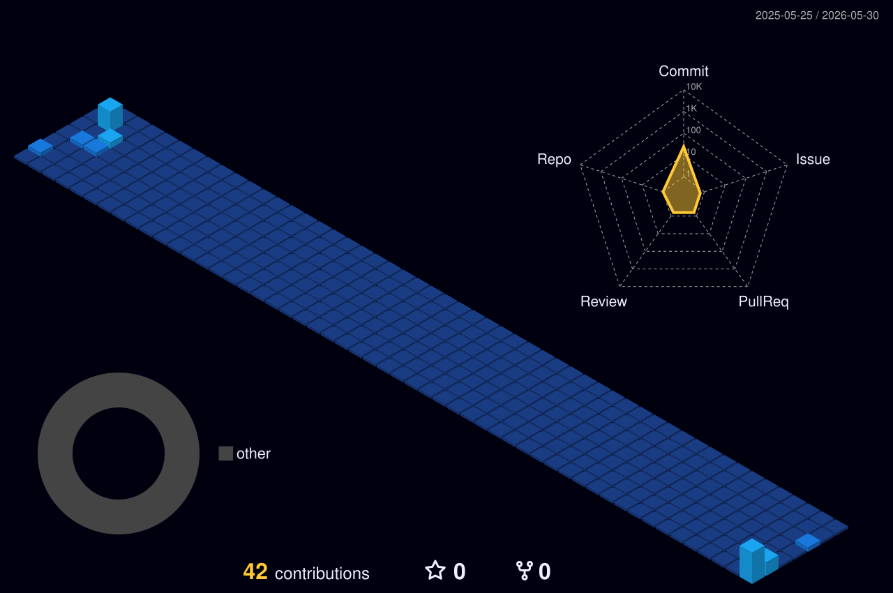

  

  
  
  

> [!IMPORTANT]
> **Professional Work Notice:** Due to company policies, my latest production implementations and agentic architectures are hosted on my professional account: **ankit-ramp**. 

---

### 🧪 About My Work
I specialize in converting unstructured enterprise chaos into streamlined, automated excellence. My focus is on **Agentic Workflows**, **High-Scale RAG Systems**, and **Production-Grade AI Pipelines**.

---

### 🛠 Tech Stack & Expertise

#### **🤖 AI & LLM**

  
  
  
  
  
  
  
  

#### **⚙️ Backend & Infrastructure**

  
  
  
  
  
  

#### **📊 Databases, BI & Low-Code**

  
  
  
  
  

#### **🛠 Tools & Testing**

  
  
  
  

#### **🌟 Familiar With**

  
  
  

---

### 💻 What I Build
- **Enterprise AI Systems**: RAG-based chatbots and agentic document processing using `LangChain` and `LangGraph`.
- **Automated Workflows**: Replacing manual entry via LLM-powered extraction layers and robust backend services via `FastAPI`.
- **Data & Analytics Pipelines**: Optimizing reporting efforts with `Python` pipelines and visual dashboards in `Power BI`.

---

### 🌌 My Contributions

  

---

### 📫 Reach Me

  

  

